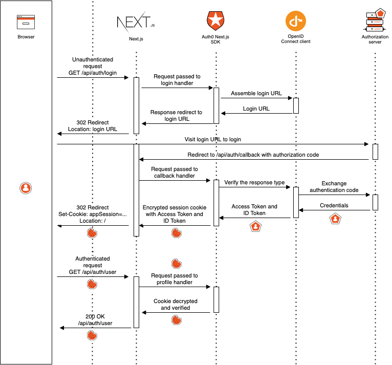
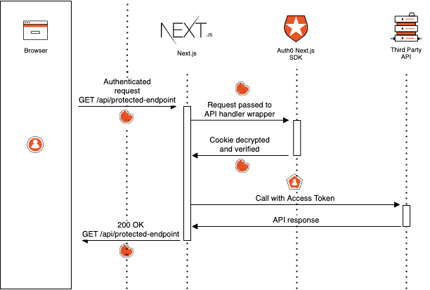
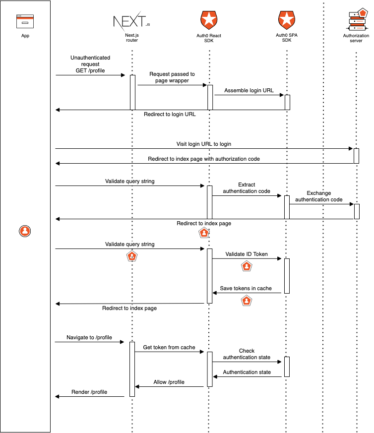

# Architecture

## Protect an API Route

With default config - [Code Flow with PKCE](https://authok.cn/docs/flows/authorization-code-flow-with-proof-key-for-code-exchange-pkce) 

## Access an External API from an API Route

## authok-react (Access Token Auth)
### Protecting a Client Side Rendered (CSR) Page

